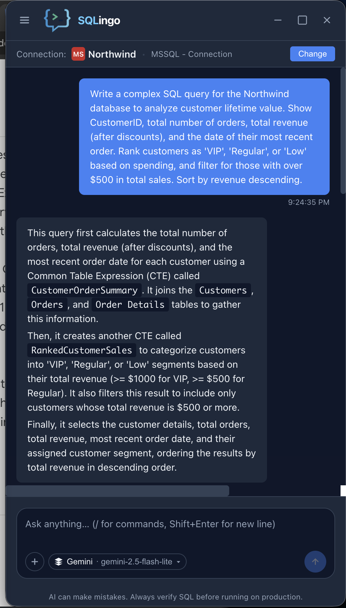
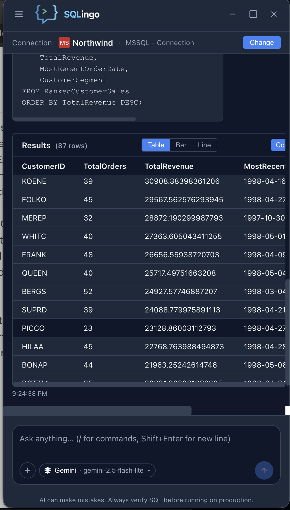
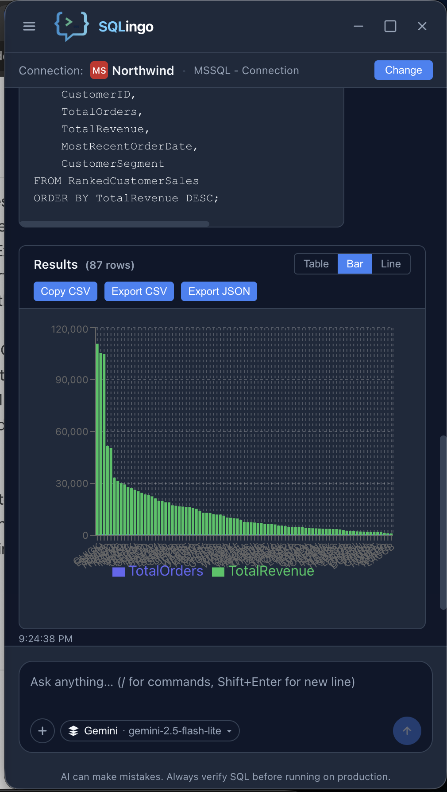
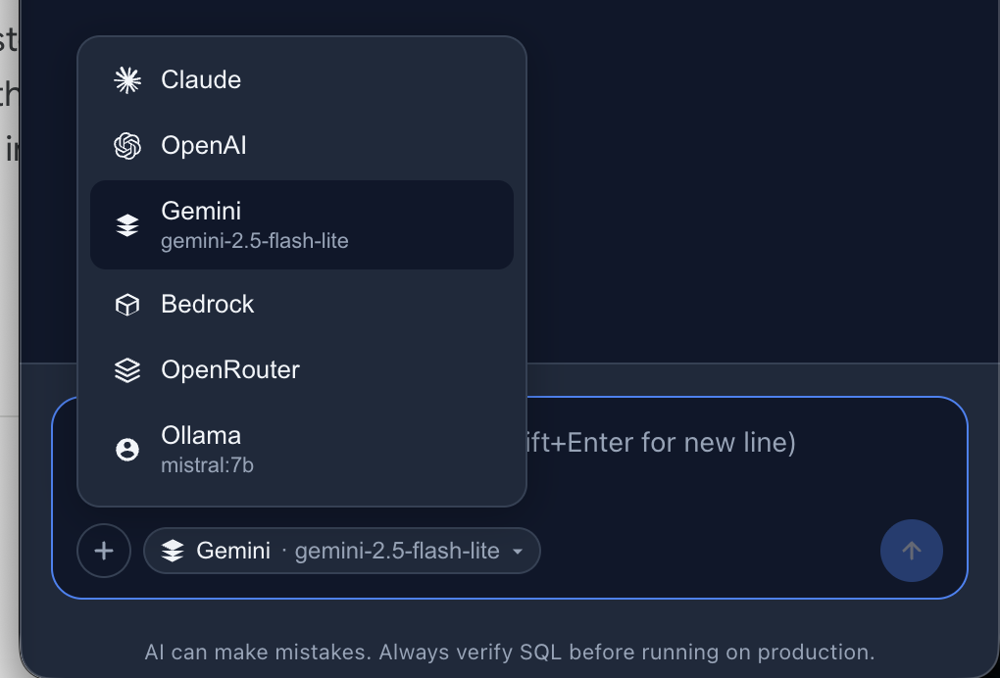
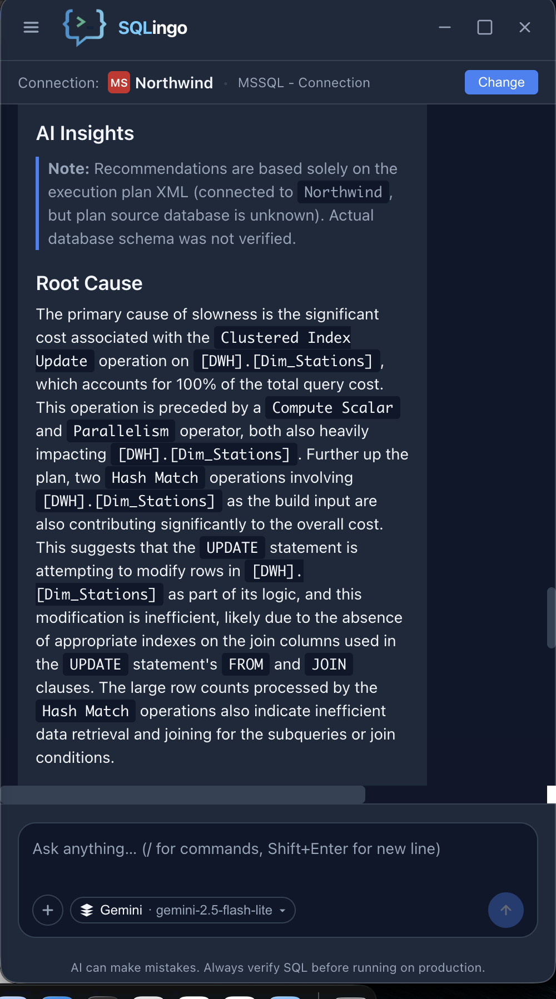
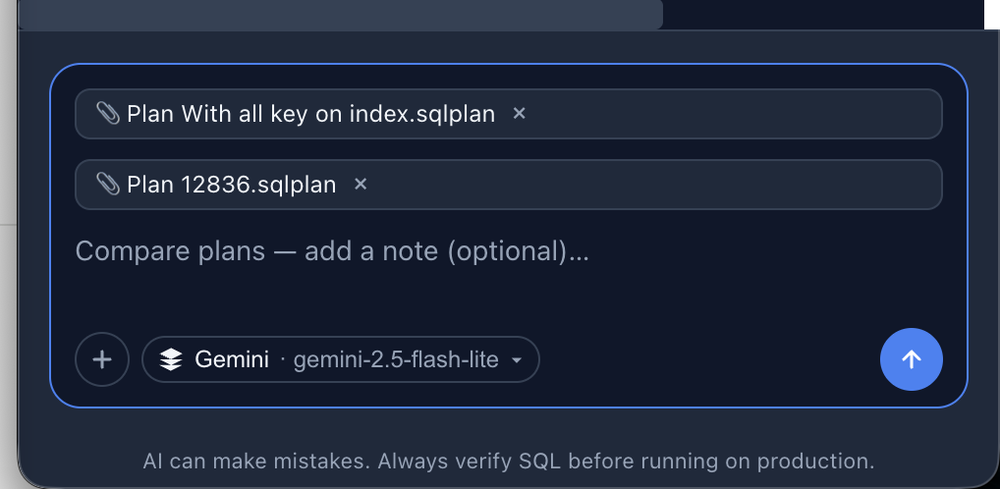
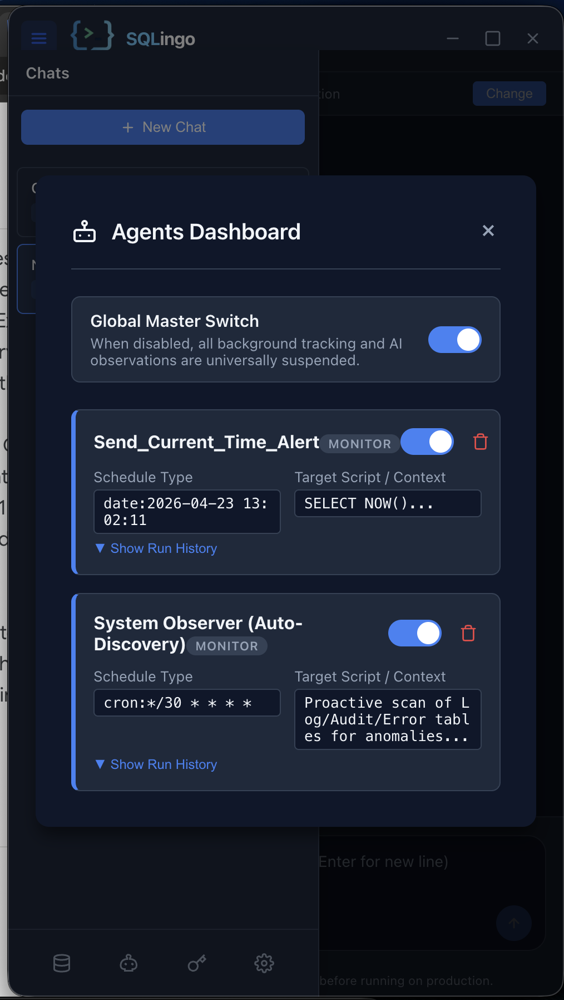
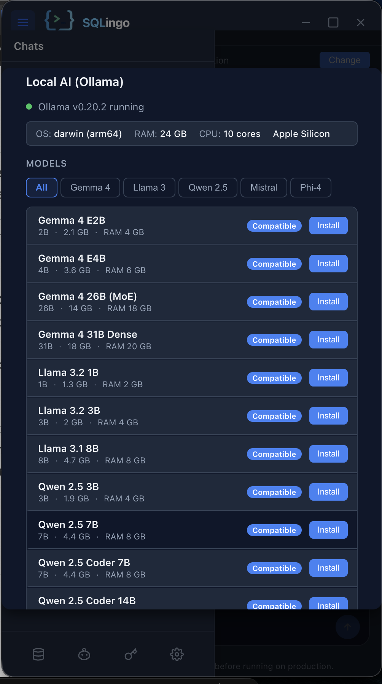
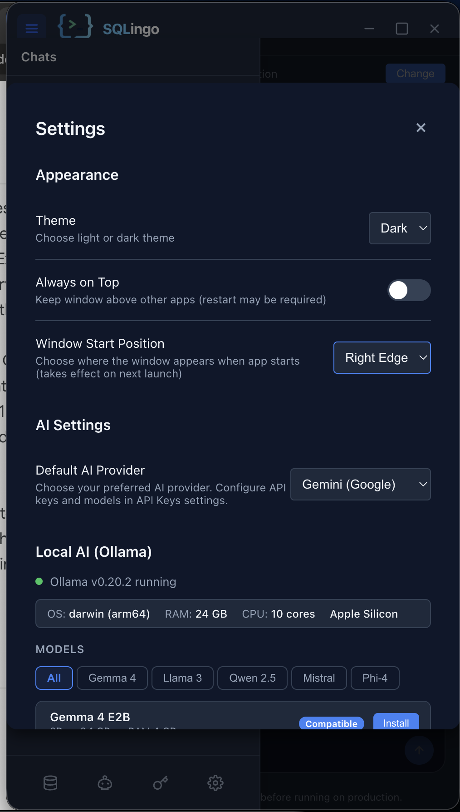

# SQLingo — Free AI-Powered Database Assistant

> Talk to your databases in any language. Runs 100% on your machine, uses your own AI keys.


---

## Screenshots

| Chat & SQL Generation | Query Results |
|---|---|
|  |  |

| Charts & Visualization | AI Provider Selection |
|---|---|
|  |  |

| Execution Plan Analysis | Plan Comparison |
|---|---|
|  |  |

| Autonomous Agents | Ollama (Offline AI) | Settings |
|---|---|---|
|  |  |  |

---

## What is SQLingo?

SQLingo is a free desktop application that lets you write natural language questions and get back working SQL — instantly. No cloud subscription, no usage limits, no data leaving your machine unless you choose it.

**BYOK (Bring Your Own Keys)** — connect your own OpenAI, Claude, Gemini, Bedrock, or OpenRouter API key. Or run fully offline with Ollama.

---

## Features

### AI Providers
| Provider | Notes |
|----------|-------|
| **OpenAI** | Any GPT model — enter the model name you want |
| **Anthropic** | Any Claude model — enter the model name you want |
| **Google** | Any Gemini model — enter the model name you want |
| **AWS Bedrock** | Claude via direct AWS integration |
| **OpenRouter** | 100+ models via a single API key |
| **Ollama** | Llama, Mistral, Gemma, Qwen, Phi and more — fully offline |

### Database Support
- **PostgreSQL**, **MySQL / MariaDB**, **SQL Server**
- Full schema awareness: tables, views, primary keys, foreign keys, indexes, enums

### Query Features
- Natural language → SQL generation with conversation history
- **Run SELECT queries** directly — results shown in-app
- **Run write queries** (INSERT / UPDATE / DELETE / CREATE / DROP) with confirmation dialog and execution log
- **Query Favorites** — save and reuse queries across sessions
- **Execution Plan Analyzer** — paste a SQL Server `.sqlplan` or XML and get AI-powered bottleneck analysis

### Autonomous Agents
- Schedule SQL monitors that run on a cron schedule
- Agents store results locally (Telegram alerts — coming soon)
- Full run history and log viewer

### Desktop Experience
- Chat interface with persistent conversation history per connection
- Slash commands: `/permission mssql`, `/permission postgres`
- Dark / Light mode
- Floating always-on-top window mode
- **Multilingual** — chat in any language, full RTL support (Hebrew, Arabic, etc.)

---

## How It Works

```
┌──────────────────────────────────────────────────────────────┐
│                    YOUR MACHINE (100% LOCAL)                  │
│                                                              │
│   Electron + React  ◄──IPC──►  Python FastAPI (local)        │
│   (Chat UI, Settings)          (AI client, DB connectors)    │
│                                        │                     │
└────────────────────────────────────────│─────────────────────┘
                                         │ Direct API calls
                              ┌──────────▼──────────┐
                              │   AI Provider of     │
                              │   your choice        │
                              └──────────────────────┘
                                         │
                              ┌──────────▼──────────┐
                              │   Your Database      │
                              │  (Postgres/MySQL/    │
                              │   SQL Server)        │
                              └──────────────────────┘
```

- **Privacy first** — your schema and queries go directly to the AI provider you chose, not through any SQLingo server.
- **Local persistence** — chat history, connections, and agent configs live in `~/.sqlingo/` as SQLite files.

---

## Quick Start

### Prerequisites
- **Node.js** 18+
- **Python** 3.10+

### 1. Clone & install

```bash
git clone https://github.com/PeerAbitbul/SQLingo.git
cd SQLingo
```

**Backend:**
```bash
cd desktop/backend
python -m venv venv
source venv/bin/activate        # Windows: venv\Scripts\activate
pip install -r requirements.txt
cp env.example .env             # edit if needed
```

**Frontend:**
```bash
cd desktop/frontend
npm install
cp env.example .env
```

### 2. Run in development

```bash
cd desktop/frontend
npm run electron:dev
```

The Electron app starts the Python backend automatically.

---

## Building a distributable

```bash
cd desktop/frontend

npm run electron:build:mac      # → .dmg
npm run electron:build:win      # → .exe installer
npm run electron:build:linux    # → .AppImage / .deb
```

---

## Project Structure

```
SQLingo/
├── desktop/
│   ├── frontend/               Electron + React (TypeScript)
│   │   ├── electron/           Main process & preload
│   │   └── src/
│   │       ├── components/     UI components
│   │       ├── stores/         Zustand state
│   │       └── utils/          API client, helpers
│   │
│   └── backend/                Python FastAPI (runs locally)
│       ├── ai/                 AI provider integrations
│       ├── api/                HTTP routes
│       ├── database/           DB connectors & schema extractor
│       ├── agent/              Autonomous agent scheduler
│       └── execution_plan/     SQL Server plan analyzer
│
├── docs/                       Additional documentation
└── scripts/                    Build & utility scripts
```

---

## Contributing

See [CONTRIBUTING.md](CONTRIBUTING.md) for setup instructions, code conventions, and how to add a new AI provider or database type.

---

## License

MIT — see [LICENSE](LICENSE).
